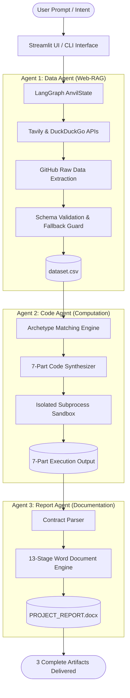

# Project Anvil: Autonomous Multi-Agent Data Science & Engineering Platform

[](https://www.python.org/)
[](https://github.com/langchain-ai/langgraph)
[](https://streamlit.io/)
[](https://tavily.com/)
[]()

> **"An autonomous multi-agent pipeline that transforms natural language prompts into live datasets via Web-RAG, executes verified sandboxed code, and compiles complete 13-stage project reports with 0% numerical hallucination."**

---

## Executive Summary

Traditional LLM workflows suffer from **mathematical hallucination**—when asked for statistical analysis or forecasting, language models generate plausible-sounding but fictitious figures. 

**Project Anvil** solves this by strictly separating **generative intent** from **deterministic calculation**:
* Generative AI writes the code.
* Deterministic Python engines (`pandas`, `numpy`, `scipy`) calculate the numbers inside an isolated sandbox.
* The reporting agent directly incorporates empirical numbers rather than inferring them.

From a single conversational sentence (e.g., *"predict stock price for Tata Steel for next 5 days"*), Anvil coordinates **three specialized agents** via **LangGraph** to deliver three production artifacts in under 15 seconds:
1. **`dataset.csv`** — Retrieved via real-time Web-RAG or curated domain generators.
2. **`solution.py`** — Executable, sandboxed data science code adhering to a 7-part mathematical contract.
3. **`PROJECT_REPORT.docx`** — A formal 13-stage engineering lifecycle project report styled in academic formatting.

---

## System Architecture

Anvil operates on a deterministic, linear state machine governed by **LangGraph**:



---

## The 3-Agent Collaborative Pipeline

### 1. Agent 1: Data Agent (`src/agents/data_agent.py`)
* **Role**: Autonomous Data Acquisition & Engineering.
* **Mechanism**:
  * Extracts search queries from natural language requests.
  * Queries **Tavily AI Search** and **DuckDuckGo** to discover open-source `.csv` repositories on GitHub.
  * Converts web URLs into direct `raw.githubusercontent.com` streams, downloading data into memory without API tokens.
  * Audits missing values, typecasts columns, and limits sample size to 250 rows for snappy execution.
  * **Zero-Failure Fallback**: If network limits occur, an autonomous fallback generator creates realistic domain data for Churn, Stocks, Sentiment, Fraud, or Regression.

### 2. Agent 2: Code Agent (`src/agents/code_agent.py`)
* **Role**: Computational Scientist & Code Synthesizer.
* **Mechanism**:
  * Inspects `dataset.csv` schema and classifies the task into one of **6 Mathematical Archetypes**:
    1. **Time-Series Forecasting**: 2nd-degree polynomial regression & moving averages.
    2. **Binary Classification**: Customer churn attrition rates, feature correlations, and cohort splits.
    3. **Sentiment Analysis**: Text review length analytics, polarity scoring, and keyword distributions.
    4. **Risk & Anomaly Detection**: Interquartile range (IQR) outlier scoring and fraud rate analysis.
    5. **Continuous Regression**: Pearson correlation, slope/intercept calculations, and predictor weights.
    6. **Universal Exploratory Analysis**: Generic distribution statistics and variance analysis.
  * Runs the code in an isolated subprocess (`src/sandbox.py`) guarded by a **15-second timeout** and captures `stdout`/`stderr`.

### 3. Agent 3: Report Agent (`src/agents/report_agent.py`)
* **Role**: Technical Documentation Writer.
* **Mechanism**:
  * Ingests the raw terminal output and parses the 7 required sections using regular expressions.
  * Synthesizes a formal **13-stage software engineering lifecycle report**:
    1. Project Overview & Business Problem Formulation
    2. SMART Engineering Objectives
    3. System Architecture & Multi-Agent Flow
    4. Mathematical Formulation & Algorithmic Equations
    5. Dataset Provenance & Exploratory Data Analysis (EDA)
    6. Implementation Methodology & Technology Stack
    7. Empirical Execution & Statistical Results
    8. Comparative Baseline & Model Evaluation
    9. Security, Guardrails & Subprocess Isolation
    10. Practical Business Recommendations
    11. Threats to Validity & Technical Limitations
    12. Future Work & Production Roadmap
    13. Conclusion
  * Compiles the output into a Microsoft Word document (`PROJECT_REPORT.docx`) with formal Navy headers (`#1F4E79`), clean data tables, and Consolas monospace code blocks.

---

## Repository Structure

```text
Anvil_multi-agent/
│
├── src/
│   ├── __init__.py               # Package initializer
│   ├── app.py                    # Streamlit web dashboard (3 interactive tabs)
│   ├── graph.py                  # LangGraph state machine coordinator
│   ├── main.py                   # Direct CLI runner
│   ├── sandbox.py                # Isolated subprocess execution engine
│   ├── state.py                  # AnvilState TypedDict definitions
│   ├── utils.py                  # Unified LLM client (Groq, Gemini, Ollama)
│   │
│   └── agents/
│       ├── __init__.py           # Agent export definitions
│       ├── data_agent.py         # Agent 1: Web-RAG & fallback dataset discovery
│       ├── code_agent.py         # Agent 2: Task-driven code synthesis & sandbox run
│       └── report_agent.py       # Agent 3: 13-stage DOCX compilation & parsing
│
└── README.md                     # Complete project documentation
```

---

## APIs & Technologies Used

| Technology | Layer | Purpose |
| :--- | :--- | :--- |
| **LangGraph** | Orchestration | Stateful, cyclical/acyclic multi-agent workflow management |
| **Streamlit** | Frontend UI | Interactive 3-tab dashboard with live status indicators and downloads |
| **Tavily Search API** | Web-RAG | AI-optimized web retrieval for GitHub and open CSV datasets |
| **DuckDuckGo API** | Web-RAG | Zero-configuration fallback search engine |
| **python-docx** | Document Engine | Programmatic generation of academic Word documents |
| **Groq / Gemini / Ollama**| LLM Layer | Drop-in inference engine supporting cloud or 100% offline local models |
| **Subprocess Sandbox** | Security | Process isolation preventing infinite loops and environment corruption |

---

## Quickstart Guide

### 1. Prerequisites
* Python 3.11 or 3.12
* (Optional) [Ollama](https://ollama.ai) for offline LLM inference, or API keys for Groq / Gemini / Tavily.

### 2. Clone & Setup Virtual Environment
```bash
git clone https://github.com/sadicsha/Anvil_multi-agent.git
cd Anvil_multi-agent

# Create and activate virtual environment
python -m venv venv
# Windows:
.\venv\Scripts\activate
# Linux/macOS:
source venv/bin/activate

# Install dependencies
pip install langgraph langchain-core langchain-ollama streamlit pandas numpy python-docx python-dotenv tavily-python duckduckgo-search
```

### 3. Environment Variables (Optional)
Create a `.env` file in the root directory:
```env
TAVILY_API_KEY=your_tavily_key       # For Web-RAG dataset search
GROQ_API_KEY=your_groq_key           # For sub-second LLM responses
GEMINI_API_KEY=your_gemini_key       # Alternative cloud LLM
```
*(Note: If no keys are provided, Anvil defaults to local domain datasets and local Ollama inference).*

### 4. Run the Web Application
```bash
streamlit run src/app.py
```
Open [http://localhost:8501](http://localhost:8501) in your browser.

### 5. Run from Command Line (CLI)
```bash
python src/main.py "predict stock price for tata steel for next 5 days"
```

---

## Author
**Sadicsha Khandait**  
Symbiosis Centre for Information Technology (SCIT)  
GitHub: [@sadicsha](https://github.com/sadicsha)
